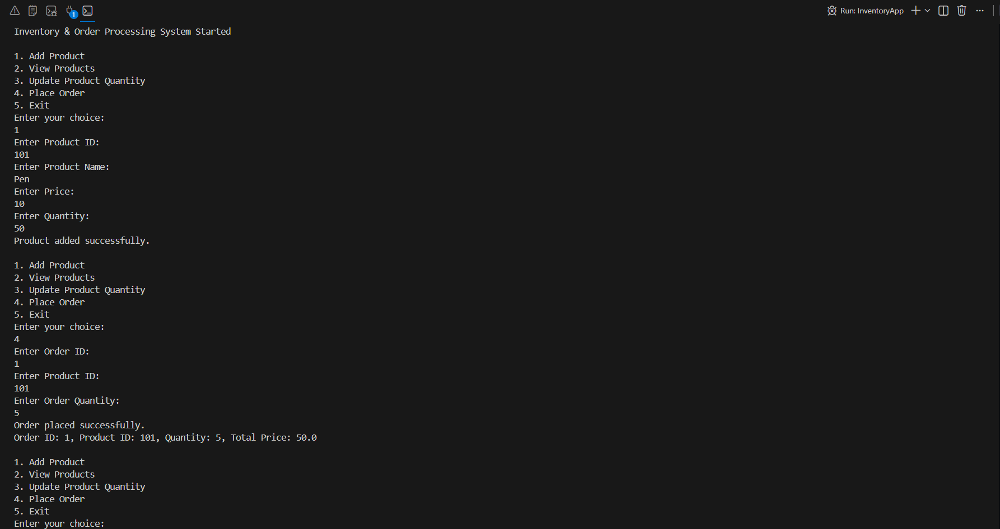

# Inventory & Order Processing System (Core Java)

A console-based Java application built using Core Java concepts.

## Features

- Add and view products
- Update product quantity
- Place orders with stock validation
- Inventory management using HashMap

## Version Plan

- `v1`: Stable Core Java console version with in-memory inventory and order placement.
- `v2`: Next local update after testing new improvements.

## Technologies Used

- Java
- OOP (Encapsulation, Classes, Objects)
- Collections (HashMap)
- Console I/O

## Project Structure

- model: Product and Order classes
- service: Inventory business logic
- app: Main application and menu

## How to Run

Compile the application:

```bash
javac -d out src/com/yesebu/inventory/model/Product.java src/com/yesebu/inventory/model/Order.java src/com/yesebu/inventory/service/InventoryService.java src/com/yesebu/inventory/app/InventoryApp.java
```

Run the application:

```bash
java -cp out com.yesebu.inventory.app.InventoryApp
```

## Sample Execution



## Purpose

This project was built to strengthen Java fundamentals and logical thinking.
