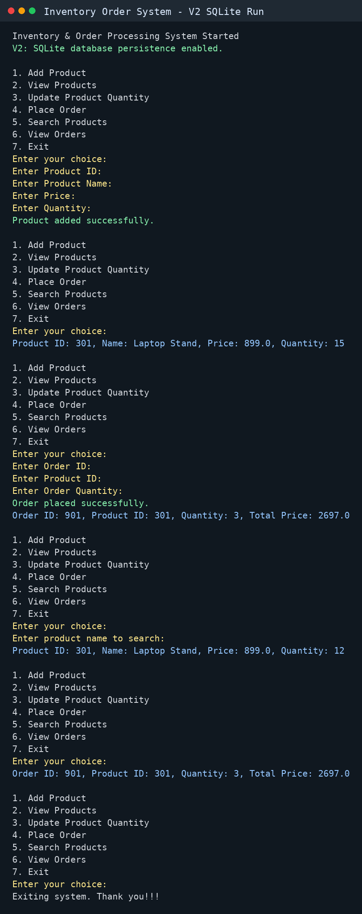

# Inventory & Order Processing System (Core Java + SQLite)

A console-based Java application built using Core Java concepts and SQLite database persistence.

## Features

- Add and view products
- Update product quantity
- Place orders with stock validation
- Store products and orders in a SQLite database
- Search products by name
- View order history
- Safer console input handling

## Version Plan

- `v1`: Stable Core Java console version with in-memory inventory and order placement.
- `v2`: Database-backed version with persistent products, order history, product search, and input validation.

## Technologies Used

- Java
- OOP (Encapsulation, Classes, Objects)
- JDBC
- SQLite
- Console I/O

## Project Structure

- model: Product and Order classes
- dao: Database access for products and orders
- db: SQLite database setup and connection management
- service: Inventory business logic
- app: Main application and menu
- scripts: Helper scripts for dependency download, compile, and run

## How to Run

Download the SQLite JDBC driver:

```bash
./scripts/download-sqlite-driver.sh
```

Compile the application:

```bash
./scripts/compile.sh
```

Run the application:

```bash
./scripts/run.sh
```

The application creates `data/inventory.db` automatically. This file is ignored by Git because it is local runtime data.

## V2 Manual Test Flow

1. Add a product.
2. View products and confirm it appears.
3. Place an order for that product.
4. View products again and confirm quantity is reduced.
5. View orders and confirm the order is saved.
6. Exit and run the app again.
7. View products/orders to confirm data persisted.

## Sample Execution



## Purpose

This project was built to strengthen Java fundamentals and logical thinking.
