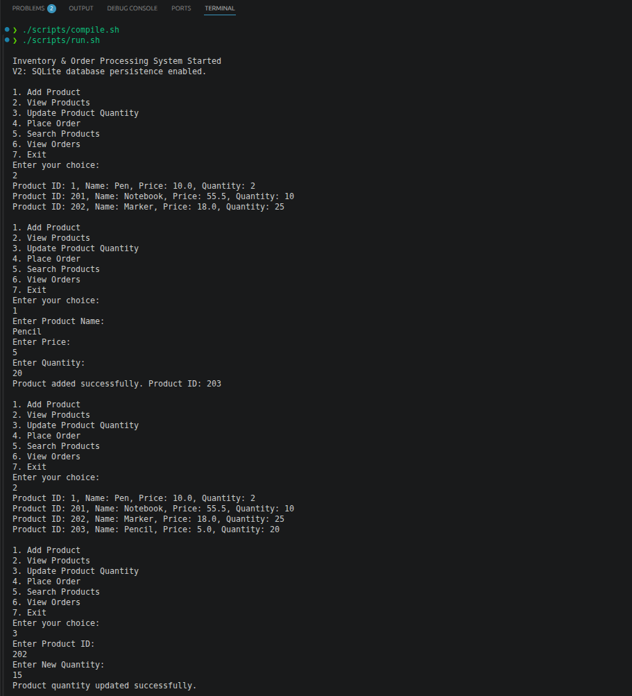
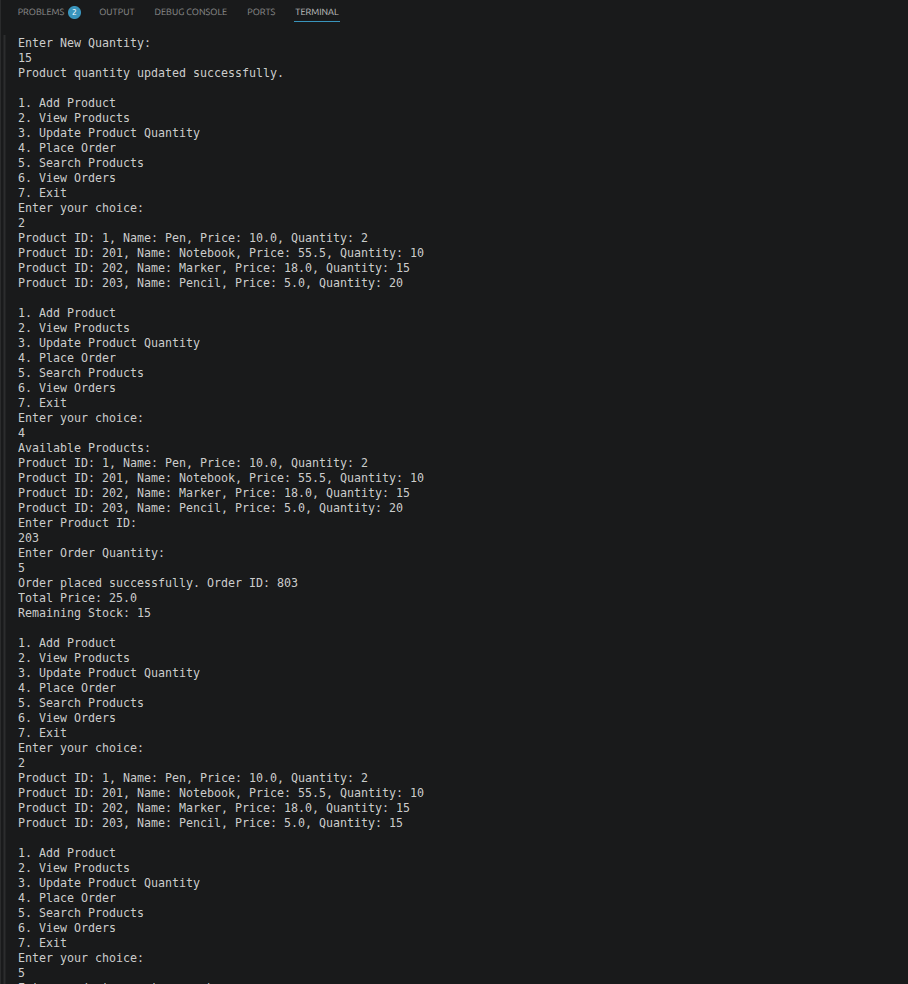
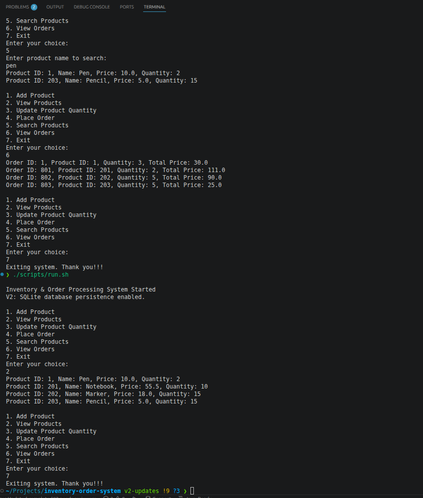

# Inventory & Order Processing System (Core Java + SQLite)

A console-based Java application built using Core Java concepts and SQLite database persistence.

## Features

- Add and view products
- Update product quantity
- Place orders with stock validation
- Auto-generate product and order IDs using SQLite
- Store products and orders in a SQLite database
- Search products by name
- View order history
- Safer console input handling

## Version Plan

- `v1`: Stable Core Java console version with in-memory inventory and order placement.
- `v2`: Database-backed version with auto-generated IDs, persistent products, order history, product search, and input validation.

## Technologies Used

- Java
- OOP (Encapsulation, Classes, Objects)
- JDBC
- SQLite
- Console I/O

## Project Structure

```text
inventory-order-system/
├── screenshots/   # README execution screenshots
├── scripts/       # Helper scripts to download, compile, and run
├── src/           # Java source code
│   └── com/yesebu/inventory/
│       ├── app/       # Console menu and user input flow
│       ├── dao/       # Product and order database access
│       ├── db/        # SQLite setup and connection management
│       ├── model/     # Product and Order classes
│       └── service/   # Inventory business logic
├── data/          # Local SQLite database, ignored by Git
├── lib/           # Local SQLite JDBC jar, ignored by Git
└── out/           # Compiled class files, ignored by Git
```

## How to Run

Download the SQLite JDBC driver:

```bash
./scripts/download-sqlite-driver.sh
```

Compile the application:

```bash
./scripts/compile.sh
```

Run the application:

```bash
./scripts/run.sh
```

The application creates `data/inventory.db` automatically. This file is ignored by Git because it is local runtime data.

## V2 Manual Test Flow

1. Add a product.
2. Confirm the app displays the generated product ID.
3. View products and confirm it appears.
4. Place an order by selecting the product ID and entering only the order quantity.
5. Confirm the app displays the generated order ID, total price, and remaining stock.
6. View products again and confirm quantity is reduced.
7. View orders and confirm the order is saved.
8. Exit and run the app again.
9. View products/orders to confirm data persisted.

## V2 Execution Screenshots

Add product and view generated product ID:



Place order and view generated order ID:



Search products, view orders, and confirm persistence:



## Purpose

This project was built to strengthen Java fundamentals and logical thinking.
